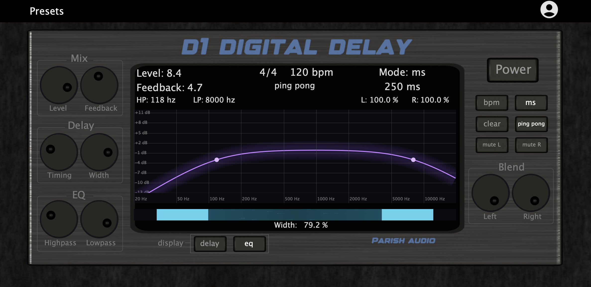

# D1 Digital Delay

A cross-platform digital delay VST3 plugin built with JUCE (C++).

This repository is a portfolio/demo build showcasing custom DSP + a fully custom JUCE GUI, including a built-in preset system (factory presets + user save/load).

## Screenshots

> Add images in `docs/screenshots/` and update paths below.

### Delay View

### EQ View

### Presets

## Features

- Stereo digital delay
- BPM sync + ms mode
- Ping-pong mode
- Feedback + mix control
- High-pass and low-pass filtering
- Stereo width control and L/R blend controls
- Factory presets + user preset save/load
- Custom-drawn UI (knobs, toggles, graphs/visualizations)

## Build

1. Install JUCE (tested with JUCE 8.x)
2. Open `D1Delay.jucer` in Projucer
3. Set your global JUCE modules path
4. Export (Xcode / Visual Studio)
5. Build the VST3 target

## Notes

The production version includes a commercial licensing/authentication system.
This public repo uses a local stub so the demo project builds and runs without network dependencies.

## Author

Nate Parish
