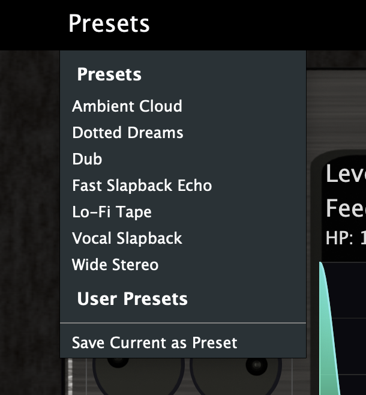

# D1 Digital Delay

A fully custom-built digital delay plugin developed with JUCE 8.

D1 Delay is a stereo digital delay featuring BPM sync, ping-pong mode, high/low pass filtering, stereo width control, and a full preset system.

Built from scratch with custom GUI rendering, DSP processing, and preset management.

---

## Screenshots

### Delay View

### EQ View

### Preset Menu

---

## Features

- Stereo Digital Delay
- BPM Sync (including time signatures)
- Millisecond Mode
- Ping-Pong Mode
- Independent Left / Right Blend Control
- High-pass and Low-pass Filtering
- Adjustable Stereo Width
- Custom Preset System
    - Built-in Presets
    - Save User Presets
    - Load Custom Presets
- Custom-drawn GUI components
- JUCE 8 Framework
- Fully C++ implementation

---

## DSP Overview

The delay engine supports:

- Sample-accurate delay timing
- Feedback routing
- Ping-pong channel alternation
- Real-time filter adjustment
- Width manipulation via stereo channel scaling
- Smooth parameter transitions

All DSP processing is written in C++ using JUCE DSP modules.

---

## UI Architecture

The GUI is entirely custom rendered using JUCE Graphics:

- Custom knobs
- Custom toggle switches
- Custom drawn delay visualization
- Animated EQ curve
- Real-time parameter display
- Custom preset dropdown

No stock UI components used beyond base JUCE elements.

---

## Preset System

The plugin supports:

- Built-in factory presets
- User-created presets
- Save / Load functionality
- Real-time preset switching

---

## Build Instructions

1. Install JUCE 8
2. Open `D1Delay.jucer` in Projucer
3. Select exporter (Xcode / Visual Studio)
4. Open generated project
5. Build VST3 or AU target

---

## Requirements

- JUCE 8
- macOS or Windows
- C++17 compatible compiler

---

## Author

Nate Parish  
Parish Audio

---

## License

This project is provided for demonstration purposes.
